## Background

SkyNet Analysis Inc. is a leading consultancy firm specializing in aviation analytics. With the aviation industry's rapid expansion and the increasing complexity of global air travel, SkyNet plays a critical role in providing data-driven insights to airlines, airports, and regulatory bodies. The company has access to extensive datasets that cover a wide range of information, including flight schedules, delays, airline operations, and airport traffic details. These datasets offer a unique opportunity to explore and understand the multifaceted nature of the aviation industry, from operational efficiency and customer satisfaction to logistical challenges and environmental impact.

## Objective

The primary objective of this case study, titled "Sky Analytics: Navigating the Complexities of Airline and Airport Operations," is to deeply analyze and interpret the extensive datasets encompassing flights, airlines, and airports - namely "flights.csv", "airlines.csv", and "airports.csv". The analysis aims to uncover critical insights into flight operations, delay patterns, airline efficiency, and airport traffic dynamics. By exploring these datasets, the study seeks to identify key factors influencing operational efficiency, understand the intricacies of flight scheduling and delays, and evaluate the performance metrics of airlines and airports. The ultimate goal is to provide strategic recommendations to enhance operational effectiveness, improve customer experiences in air travel, and contribute to the overall advancement of the aviation industry's standards and practices.

## Data Source

1. **Flights Dataset**

   [flights.csv](https://almabetter.notion.site/Travel-Hospitality-e99d728ed30b491abcfe3e03d87b5e3e)

   This dataset contains detailed flight information, including timings, delays, and other flight-specific data.

   - **YEAR, MONTH, DAY, DAY_OF_WEEK**: Date and day information for the flight.
   - **AIRLINE**: Airline identifier.
   - **FLIGHT_NUMBER**: Flight number.
   - **TAIL_NUMBER**: Aircraft tail number.
   - **ORIGIN_AIRPORT, DESTINATION_AIRPORT**: Airport codes for origin and destination.
   - **SCHEDULED_DEPARTURE, DEPARTURE_TIME**: Scheduled and actual departure times.
   - **DEPARTURE_DELAY**: Delay in departure (minutes).
   - **TAXI_OUT**: The time duration between departure from the gate and wheels off.
   - **WHEELS_OFF, WHEELS_ON**: Time when wheels were off/on the ground.
   - **SCHEDULED_TIME**: Scheduled duration of the flight.
   - **ELAPSED_TIME**: Actual time taken for the flight.
   - **AIR_TIME**: Time in the air.
   - **DISTANCE**: Distance covered by the flight.
   - **TAXI_IN**: The time duration from wheels on to arrival at the gate.
   - **SCHEDULED_ARRIVAL, ARRIVAL_TIME**: Scheduled and actual arrival times.
   - **ARRIVAL_DELAY**: Delay in arrival (minutes).
   - **DIVERTED, CANCELLED**: Indicators for diverted or cancelled flights.
   - **CANCELLATION_REASON**: Reason for cancellation (if any).
   - **AIR_SYSTEM_DELAY, SECURITY_DELAY, AIRLINE_DELAY, LATE_AIRCRAFT_DELAY, WEATHER_DELAY**: Different types of delays (minutes).

2. **Airlines Dataset**

   This dataset provides information about various airlines.

   - **IATA_CODE**: Unique airline code.
   - **AIRLINE**: Full name of the airline.

3. **Airports Dataset**

  This dataset contains information about various airports.

   - **IATA_CODE**: Unique airport code.
   - **AIRPORT**: Full name of the airport.
   - **CITY**: City where the airport is located.
   - **STATE**: State where the airport is located.
   - **COUNTRY**: Country where the airport is located.
   - **LATITUDE, LONGITUDE**: Geographic coordinates of the airport.

## Part 1: Excel Data Analysis: Manipulation, Formulas and Functions

1. **Flight Delays Analysis:**
    - Determine the average flight delay per airline. What are the top 3 airlines with the highest average delays?

    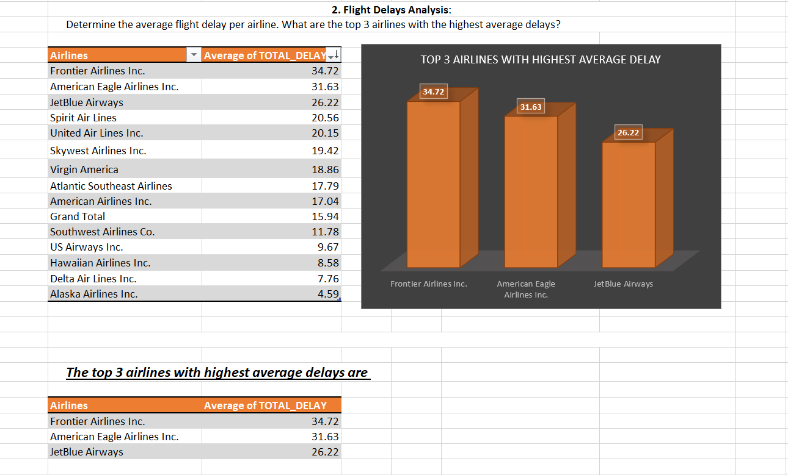

    ### Insights:
    - The analysis revealed that Airlines Frontier Airlines Inc., American Eagle Airlines Inc., JetBlue Airways  have the highest average delays.
   
2. **Airport Traffic Volume:**
    - Identify the top 5 busiest airports based on the number of incoming and outgoing flights.

    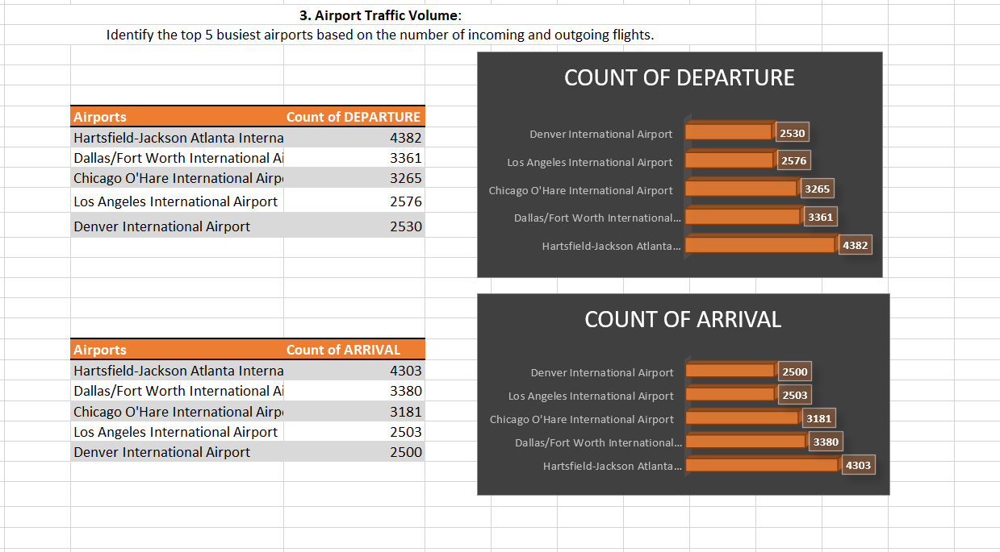

    ### Insights:
    - Hartsfield-Jackson Atlanta International Airport is the most busiest airport.

3. **Flight Cancellation Insights:**
    - Analyze the flight cancellations: Which airline has the highest cancellation rate, and what are the most common reasons for cancellations?

    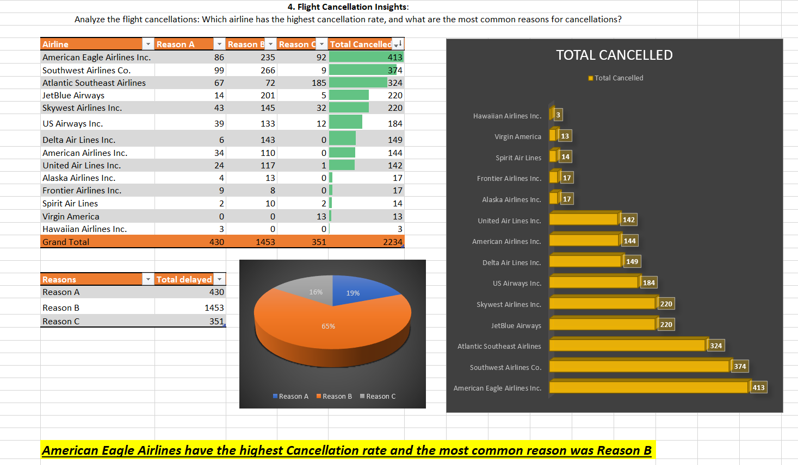

    ### Insights:
    - American Eagle Airlines have the highest Cancellation rate and the most common reason for Cancellation was Reason B										

4. **Correlation between Distance and Delays:**
    - Investigate if there's a correlation between the distance of the flight and the length of delays. Use scatter plots for visualization.

    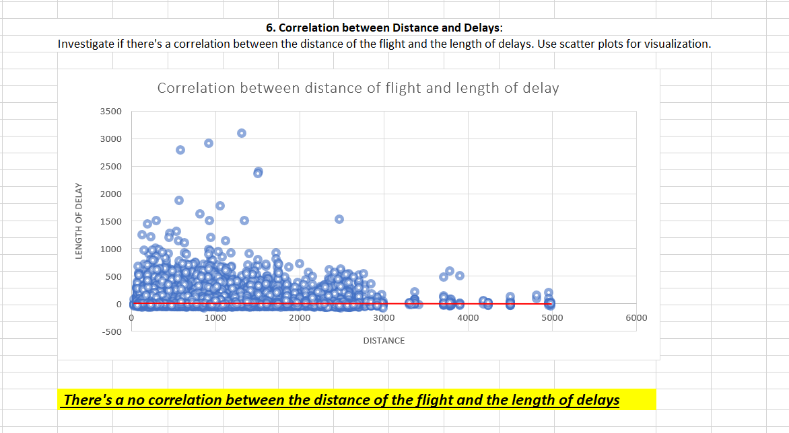

    ### Insights:
    -  There's a no correlation between the distance of the flight and the length of delays									

5. **Efficiency of Airlines:**
    - Calculate the on-time performance (percentage of flights that are not delayed) for each airline. Rank them based on this metric.

    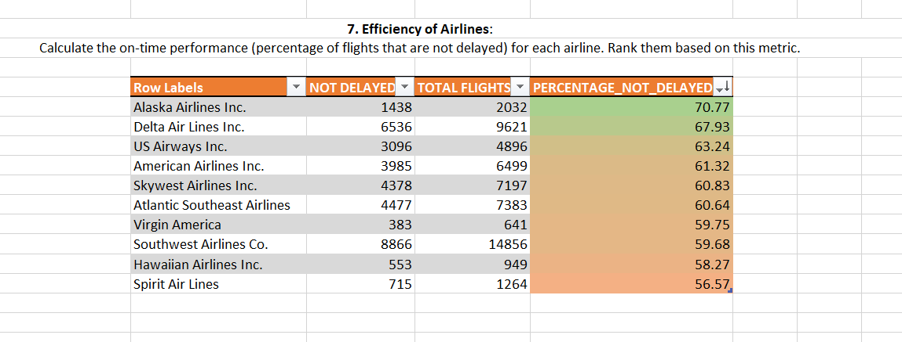

    ### Insights:
    - The insights are shown above in the table.

6. **Impact of Day of Week on Flight Operations:**
    - Assess how flight operations (delays, cancellations) vary by the day of the week.

    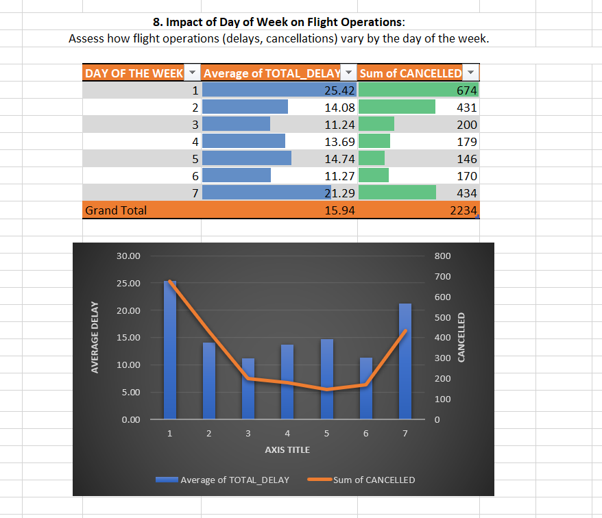

    ### Insights:
    - Monday has the most delayed flights and it also has the highest average delay time as compared to others.

7. **Analysis of Airport Connectivity:**
    - Which airports serve as the most significant hubs in terms of connectivity (most destinations served)?

    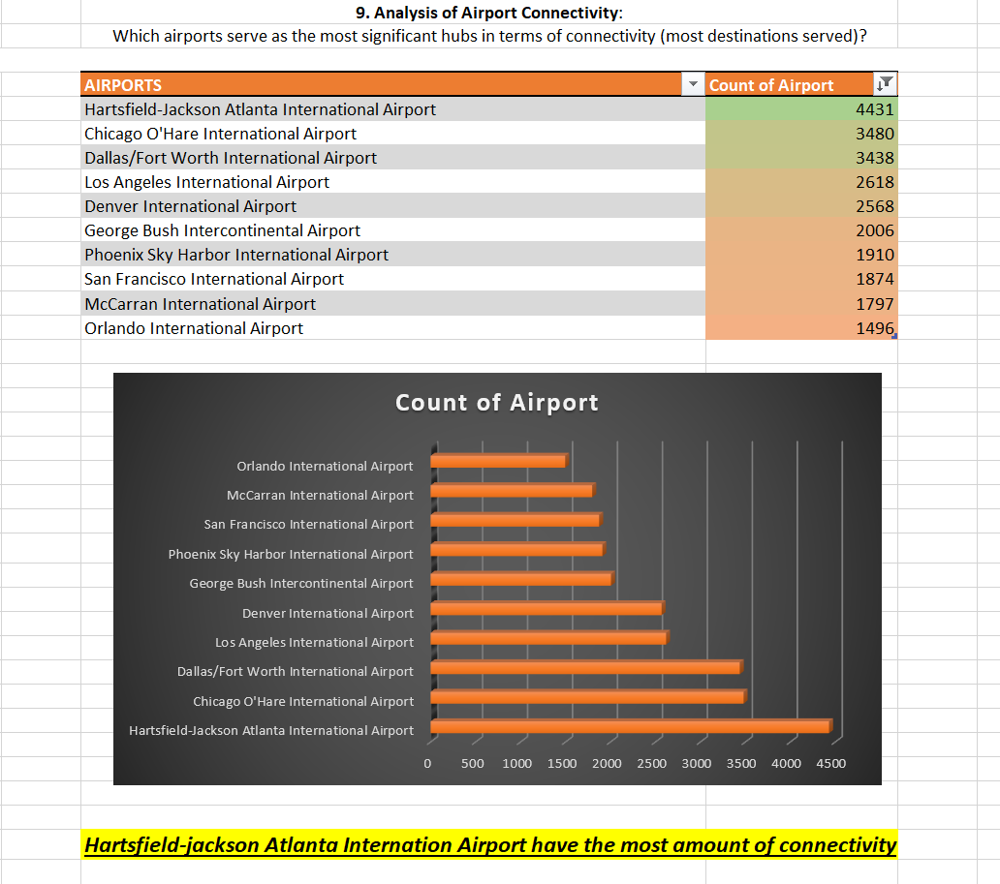

    ### Insights:
    - Hartsfield-jackson Atlanta Internation Airport have the most amount of connectivity.

8. **Flight Duration Accuracy:**
    - Compare the scheduled flight duration versus the actual flight duration. Which airlines have the most and least deviation?

    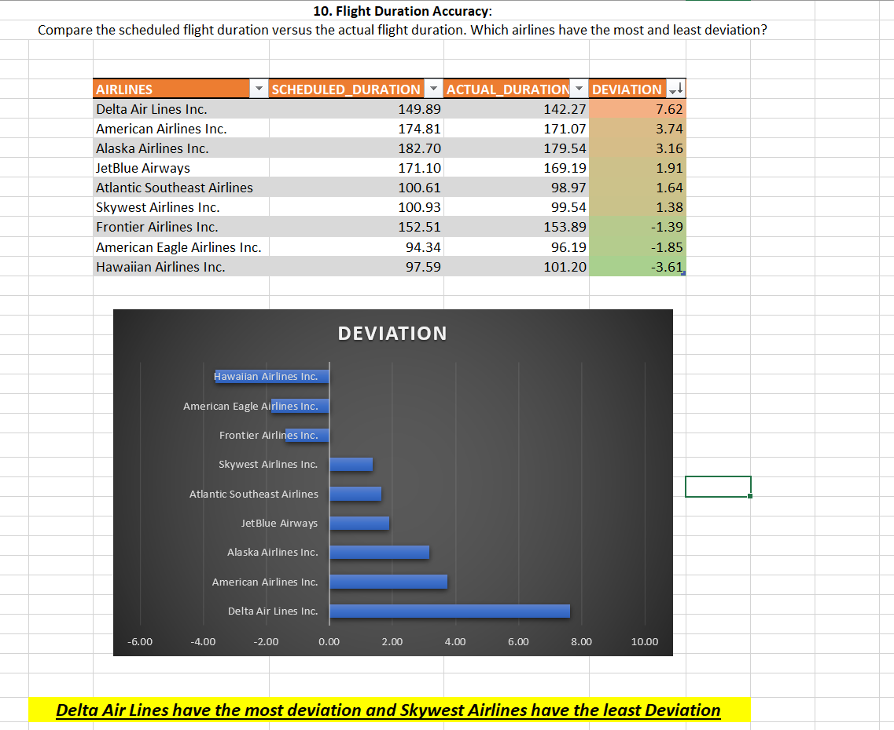

    ### Insights:
    - Delta Air Lines have the most deviation and Skywest Airlines have the least Deviation.				

9. **Airline Fleet Utilization:**
    - Based on the tail numbers, determine which airline has the highest number of flights per aircraft, indicating fleet utilization.

    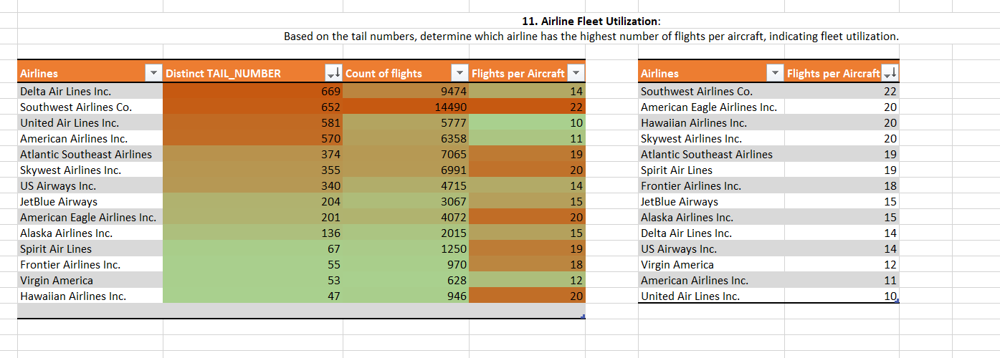

    ### Insights:
    - Southwest Airlines have the highest leet utilization

10. **Airport Geographical Analysis:**
    - Using latitude and longitude data, analyze the geographical distribution of airports. Which states or regions have the highest concentration of airports?

    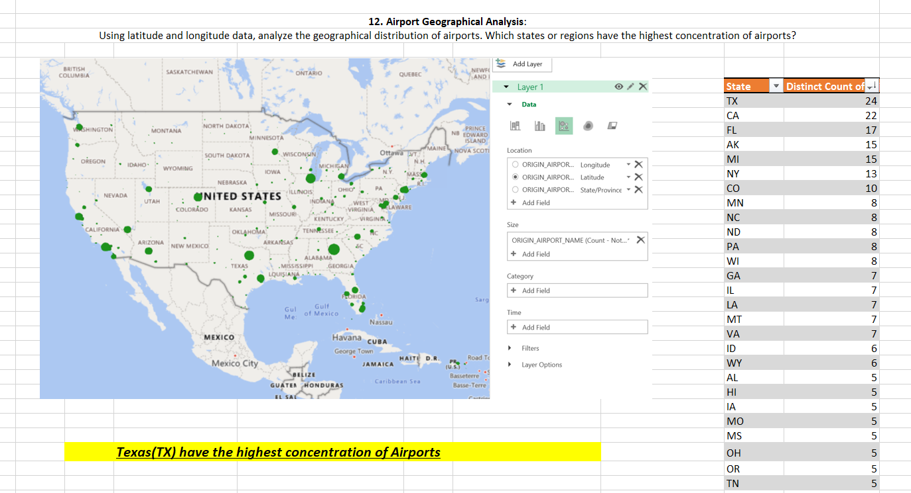

    ### Insights:
    -Texas(TX) have the highest concentration of Airports.

11. **Delayed Flights and Delay Types Analysis:**
    - For flights that are delayed, break down the delay types (airline, weather, security, etc.) and analyze their proportions.

    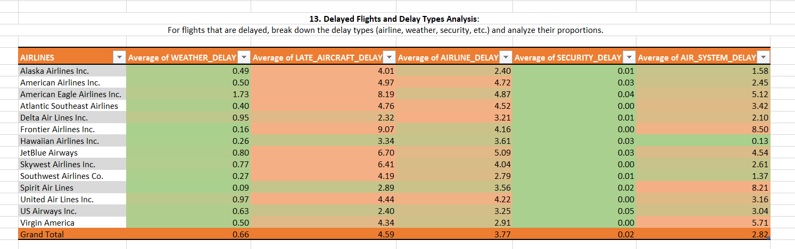

    ### Insights:
    - LATE_AIRCRAFT_DELAY, AIRLINE_DELAY have the highest proportion of delay time as compared to other factors.

12. **Long-Haul vs Short-Haul Operations:**
    - Compare the operational metrics (delays, cancellations) between long-haul and short-haul flights for different airlines.

    

    ### Insights:
    - The insights are shown in the above chart.

13. **Pivot Analysis of Flights Data:**
    - Use pivot tables to summarize key operational metrics (like average delay, number of flights, cancellations) by airline and airport.

    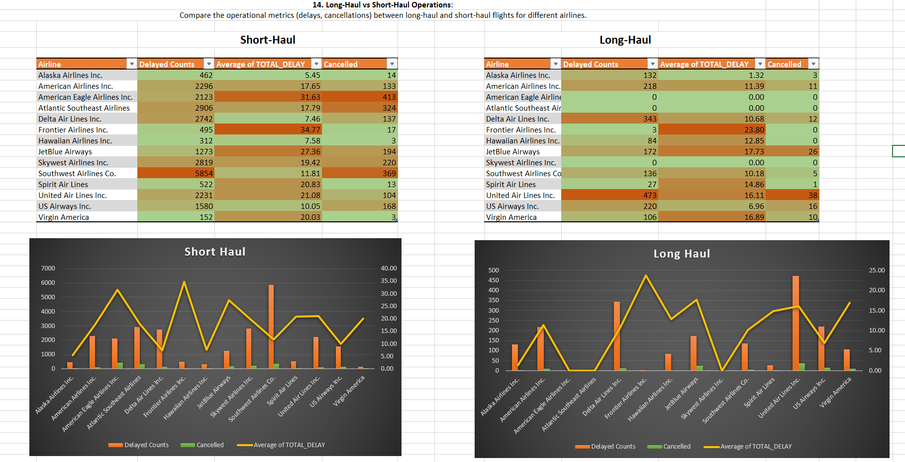

    ### Insights:
    - The insights are shown in the above table.

14. **Data Integration for Comprehensive Insights:**
    - Merge data from the "airlines.csv" and "flights.csv" to provide enhanced insights, such as correlating airline names with operational metrics. Analyze the merged data to determine the overall on-time performance of each airline, considering both arrival and departure delays.

    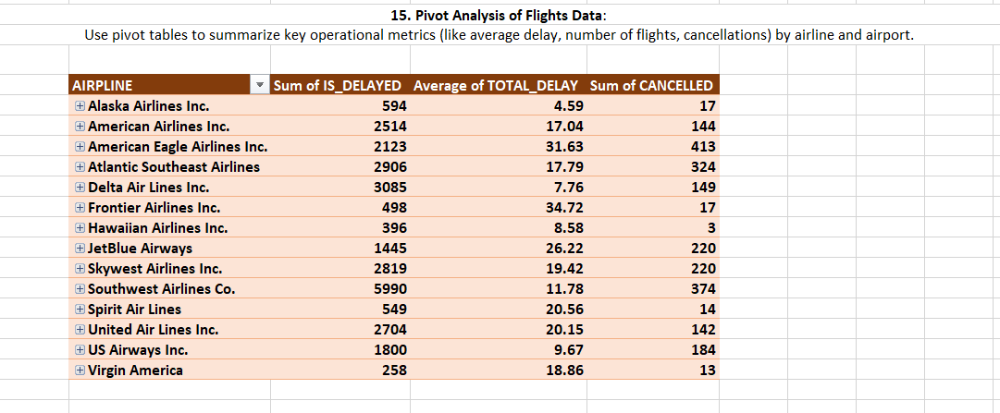

    ### Insights:
    - Frontier Airlines Inc. has the highest average departure delay as well as highest average arrival delay.

15. **Flight Delay Impact Analysis:**
    - Calculate the cumulative impact of delays for each airline. Consider both the frequency of delays and the average delay time. How do these factors combine to affect overall airline performance?

    
    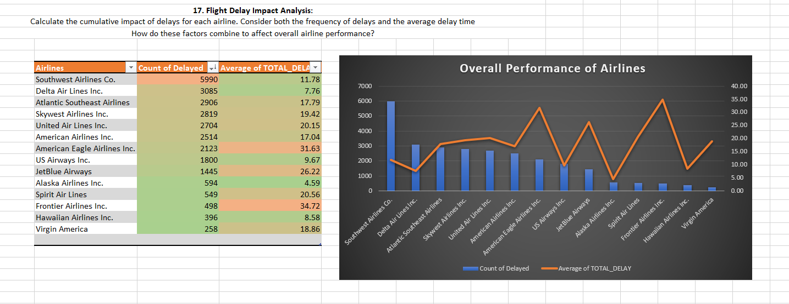

    ### Insights:
    - Southwest Airlines Co. has the most number of delay flights with an average delay time of 11.7 minutes.
    - Frontier Airlines Inc. has the higesht delay time i.e. on an average Frontier Airlines Inc. delays by almost 34 minutes

16. **Optimal Flight Path Efficiency Assessment:**
    - Using the distance data from "flights.csv" and geographical coordinates from "airports.csv", calculate the efficiency of various flight paths. Determine if there are significant differences in the efficiency of flights (measured as a ratio of actual flight time to the shortest possible time based on distance) for different airlines or types of aircraft (identified by tail number).

    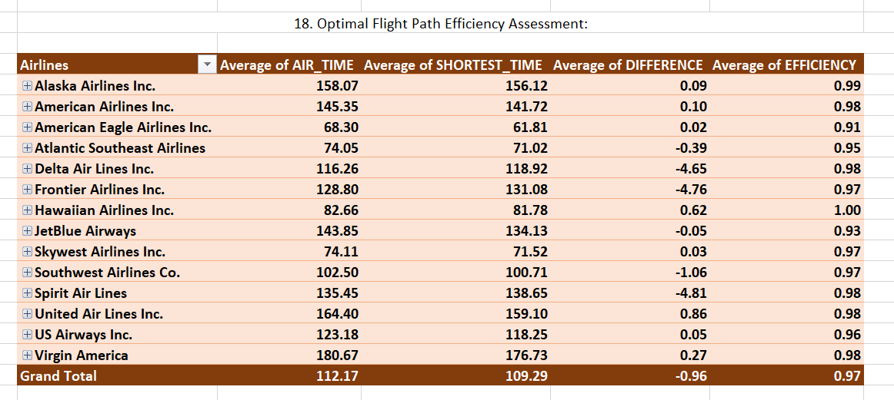
    ### Insights:
    - - - The insights are shown in the above table.

17. **Complex Delay Cause Analysis:**
    - Use nested functions to analyze the primary cause of delays for each airline. Determine if the predominant cause of delay (like airline delay, weather delay, security delay) varies by airline and time of day.

    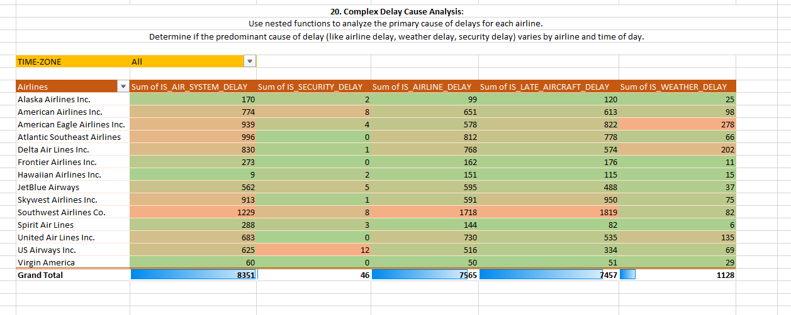

    ### Insights:
    - Air System Delay is the most common reason for delays.
    - Security Dealay is the least common reason for delays.
    - 
18. **Analysis of Flight Frequency and Peak Hours:**
    - Analyze the flight frequencies to determine the peak operating hours for major airports. Use a combination of Excel functions to categorize flights into different time slots (e.g., morning, afternoon, evening, night) and calculate the number of flights in each slot for the top 5 busiest airports.

    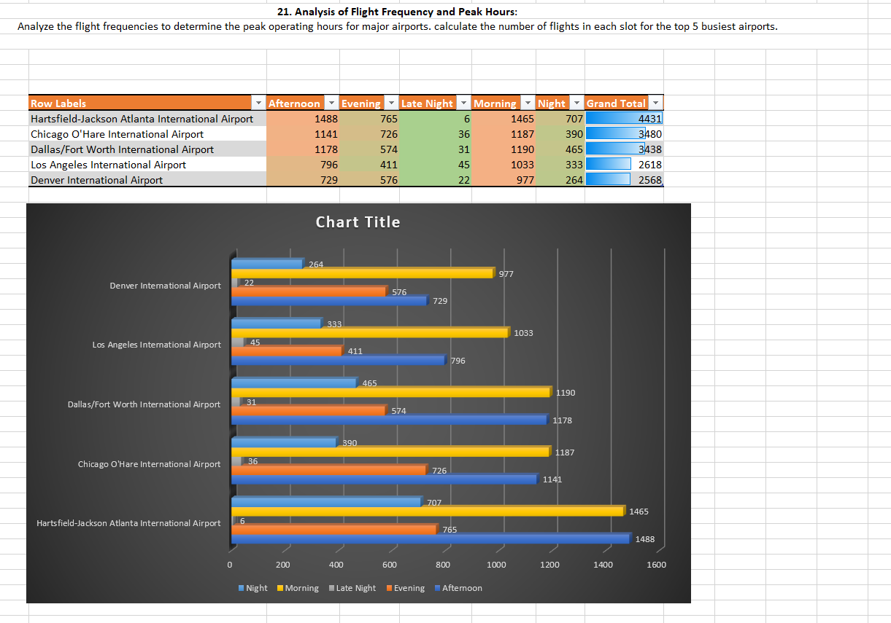

    ### Insights:
    - Most of the Airtport operates in Afternoon and morning.
   
19. **Dashboard 1:**
    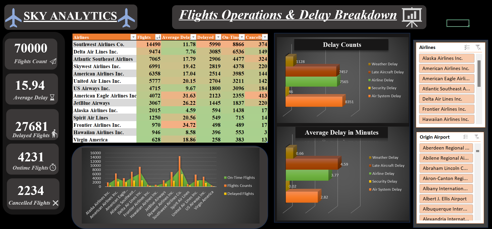

21. **Dashboard 2:**
    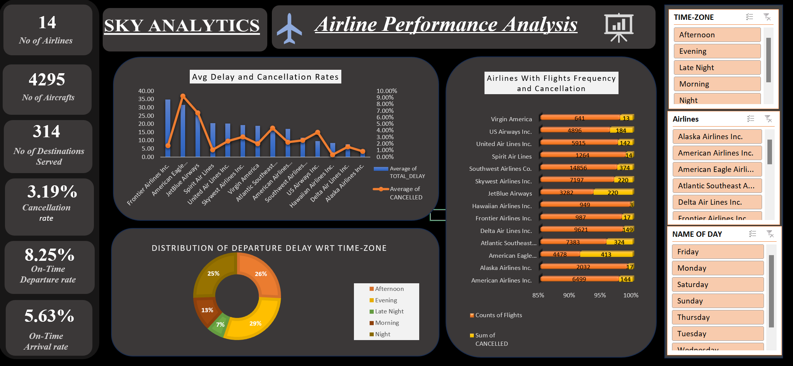

## Conclusion

This project demonstrates the use of Excel data analysis and dashboard creation to explore extensive datasets from the aviation industry. The insights gained from the analysis provide valuable information on flight operations, airline performance, and airport activity. This helps in understanding the complexities of airline and airport operations and offers actionable insights for enhancing operational efficiency and customer satisfaction.

Feel free to explore the Excel files and documentation provided in this repository to gain a deeper understanding of the project and replicate the results. If you have any questions or suggestions, please don't hesitate to reach out on this email  **jabcd.1997@gmail.com**.

Happy Exploring!

